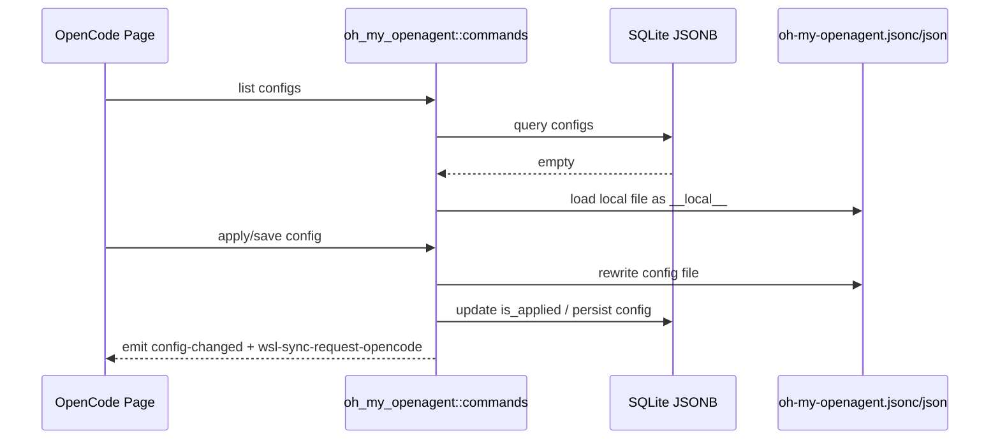

# Oh My OpenAgent 后端模块说明

## 一句话职责

- `oh_my_openagent/` 负责 OpenCode 旁挂的 Oh My OpenAgent 配置、全局配置和本地临时配置到数据库的桥接。

## Source of Truth

- 长期主数据在 SQLite JSONB 表 `oh_my_openagent_config` / `oh_my_openagent_global_config`；旧 SurrealDB 仅用于启动时一次性导入，不再镜像写入。
- 当数据库为空时，页面先看到的是从本地配置文件读取出来的临时 `__local__` 记录；它只是桥接态，不是最终持久化 ID。
- 当前生效配置文件路径由 `runtime_location::get_omo_config_path_async()` 决议，而不是写死默认文件名。

## 核心设计决策（Why）

- 该模块必须兼容历史文件名 `oh-my-opencode.*` 和新文件名 `oh-my-openagent.*`，否则升级用户会直接丢失本地配置。
- 应用配置统一走 `apply_config_internal`：写文件、更新 `is_applied`、发 `config-changed` 和 `wsl-sync-request-opencode`。
- agents key 统一做小写归一化，避免历史配置里的大小写差异造成逻辑分叉。

## 关键流程

## 易错点与历史坑（Gotchas）

- 不要把 `__local__` 当成可长期引用的真实记录 ID。它只是数据库为空时的临时桥接态。
- 前端 UI 即使后端把 `__local__` 标成已应用，也不要显示「已应用」标签、选中高亮或「应用」按钮；只保留本地来源提示。用户应先保存收编入库，再进入正式 applied 管理语义。
- 保存 `__local__` 到数据库时，要区分“整个 profile/global section 未传入”和“section 已传入但某个 optional 字段为 `None`”。后者代表用户明确清空该字段，不能再回退到本地文件旧值。
- 路径来源不是简单的“默认目录就默认、其它都 custom”，还要兼容旧文件名候选和 `runtime_location` 决议。
- 改应用逻辑时要记住它属于 OpenCode 运行时的一部分，所以 WSL 同步事件也复用 `wsl-sync-request-opencode`。
- “清除已应用配置”只删除当前决议到的运行时配置文件并取消 `is_applied`，不删除数据库里的 profile，也不是任意路径/文件名映射能力。`__local__` 不应开放该危险操作。
- 在 Windows + WSL 自动同步开启时，清除已应用配置必须先显式删除 `opencode-oh-my` 的 WSL 目标文件，再删除本机文件并取消 `is_applied`；不要只发 `wsl-sync-request-opencode`，因为普通同步会跳过不存在的源文件，不会删除远端旧文件。

## 跨模块依赖

- 依赖 `runtime_location` 决议当前配置文件路径。
- 被 `web/features/coding/opencode/` 页面中的 Oh My OpenAgent 相关组件依赖。
- 与 OpenCode 主配置、WSL 同步和托盘刷新语义相邻。

## 典型变更场景（按需）

- 改文件名或路径决议时：
  同时检查新旧文件名兼容、本地 `__local__` 加载和应用后的落盘路径。
- 改 agents/global config 保存时：
  同时检查 `is_applied`、全局字段保留和 WSL 事件。

## 最小验证

- 至少验证：数据库为空时能从本地文件生成 `__local__` 临时配置。
- 至少验证：应用配置后写入正确文件，并触发 `wsl-sync-request-opencode`。
