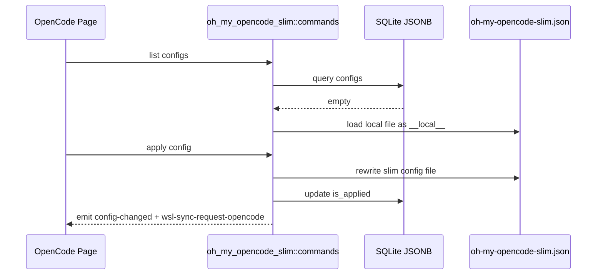

# Oh My OpenCode Slim 后端模块说明

## 一句话职责

- `oh_my_opencode_slim/` 负责 OpenCode 旁挂的 Slim 配置、全局配置和本地临时配置到数据库的桥接。

## Source of Truth

- 长期主数据在 SQLite JSONB 表 `oh_my_opencode_slim_config` 与对应 global config 记录；旧 SurrealDB 仅用于启动时一次性导入，不再镜像写入。
- 数据库为空时，页面先读取本地配置文件并映射成临时 `__local__` 记录。
- 当前配置文件路径由 `runtime_location::get_omos_config_path_async()` 决议；这条链路与 OpenCode 主配置目录绑定。

## 核心设计决策（Why）

- Slim 配置同样使用“数据库主数据 + 本地临时桥接态”的模式，保持与 OpenAgent 模块一致，减少页面分叉处理。
- 应用配置统一走 `apply_config_internal`，并复用 `wsl-sync-request-opencode`，因为它本质上仍属于 OpenCode 运行时目录的一部分。
- Slim 配置文件当前以单一文件名和更窄格式存在，不应混入 OpenAgent 的历史文件名兼容假设。

## 关键流程

## 易错点与历史坑（Gotchas）

- 不要把 `__local__` 直接当成真实记录复用；保存到数据库时必须转成正式记录。
- 该模块虽与 OpenAgent 相邻，但路径和字段语义不完全相同，不能直接复制 OpenAgent 的文件名兼容逻辑。
- 改应用/保存链路时，同样要考虑它会触发 OpenCode WSL 同步，而不是独立的 Slim 事件。
- OMOS v2 的运行时 schema 不接受 `fallback.chains`；备用模型链应写成 `agents.<agent>.model` 数组。历史 `fallback.chains` 只作为 AI Toolbox 旧数据兼容读取，应用配置时必须合并进 agent model 数组，并从最终 `fallback` 输出中剔除。
- 数据库为空时的 `__local__` 临时记录必须同时支持根级 `agents` 和官方 `preset/presets` 形态；解析规则与前端 JSON 导入保持一致：优先读取当前 `preset`，找不到且只有一个 preset 时使用该 preset，根级 `agents` 覆盖 preset 中的同名 agent 字段，并保留 `agents.<agent>` 内未结构化高级字段。
- “清除已应用配置”只删除当前决议到的运行时配置文件并取消 `is_applied`，不删除数据库里的 profile，也不是文件映射能力。`__local__` 不应开放该危险操作。
- 在 Windows + WSL 自动同步开启时，清除已应用配置必须先显式删除 `opencode-oh-my-slim` 的 WSL 目标文件，再删除本机文件并取消 `is_applied`；不要只发 `wsl-sync-request-opencode`，因为普通同步会跳过不存在的源文件，不会删除远端旧文件。

## 跨模块依赖

- 依赖 `runtime_location` 获取当前 slim 配置路径。
- 被 `web/features/coding/opencode/` 中的 Slim 相关组件依赖。
- 与 OpenCode 主配置、WSL 同步和托盘刷新相邻。

## 典型变更场景（按需）

- 改文件路径或保存逻辑时：
  同时检查 `__local__` 桥接态、`is_applied` 和 WSL 事件。
- 改 global config 字段时：
  同时检查本地文件提取和数据库记录回写是否仍对齐。

## 最小验证

- 至少验证：数据库为空时能从本地文件生成 `__local__` 临时配置。
- 至少验证：应用配置后写入正确文件，并发出 `wsl-sync-request-opencode`。
