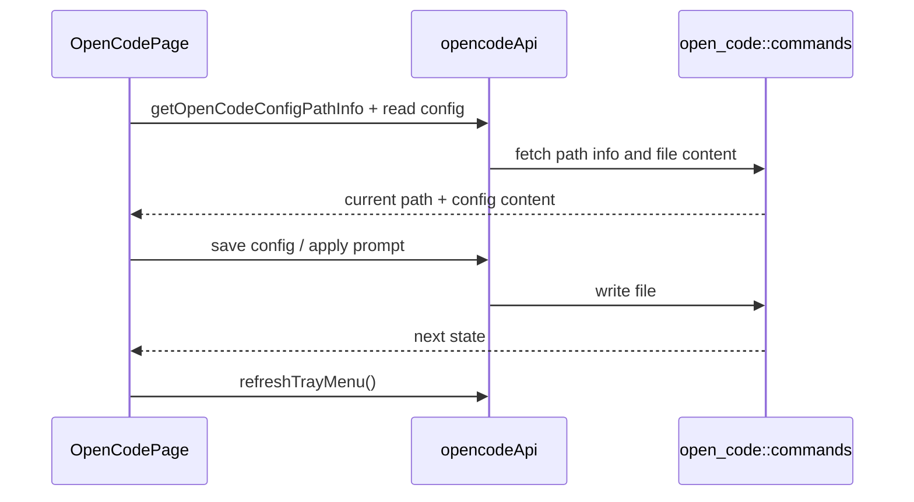

# OpenCode 前端模块说明

## 一句话职责

- `opencode/` 页面负责 OpenCode 配置编辑、provider 管理、prompt 管理、模型读取和相关导入交互。

## Source of Truth

- 页面展示的配置内容来自当前生效配置文件；`configPathInfo` 只说明路径来源，不说明是否 WSL Direct。
- `configPathInfo` 由后端 `getOpenCodeConfigPathInfo()` 返回；当前生效 prompt 路径由后端按配置文件所在目录推导。
- 页面里的主模型和小模型值都应视为完整 `provider_id/model_id`，而不是单独的模型名。
- OpenCode Core 的 Agent 配置字段是单数 `agent`，与 OMO/OMOS 插件配置里的复数 `agents` 不同；`small_model` 仍用于标题生成等轻量内部任务，不是所有 Subagent 的统一模型。
- 后端统一模型列表会把 models.dev 的 `experimental.modes.*` 展开为虚拟模型，并通过 `baseModelId` / `experimentalMode` 标记来源；页面里的 variant dropdown 应基于这些元数据继承 base model variants，不要靠 `-fast` 等后缀猜测。
- `favorite provider` 列表和诊断属于辅助历史状态，不能反推为 OpenCode 当前运行时真实配置。

## 核心设计决策（Why）

- 页面把“路径管理”与“配置内容”分开：路径通过 `ConfigPathModal` 管理，配置内容单独读取和保存，避免把文件定位和文件内容混在同一表单里。
- `ConfigPathModal` 只在 `source === custom` 时回填输入框，避免把 env/default/shell 的当前生效路径误当成用户显式保存的自定义路径。
- 托盘刷新不是自动 effect 全程接管，很多用户动作后需要显式 `refreshTrayMenu()`，否则托盘和页面状态会分叉。
- 模型刷新走受限频率的显式操作，而不是每次页面操作都重抓远端模型，避免无谓请求和体验噪音。
- Agent 模型是“模型设置”卡片内的低频子模块，默认折叠；不要再把它恢复成独立页面卡片或独立侧栏分区。其内部使用横向表单行，并按所选模型是否提供 Variant 渐进展示 Variant 字段。
- Agent 指令属于 OpenCode Core 的 `agent.<name>.prompt` 字符串。页面使用 Markdown 编辑器只是提供编辑/预览体验，保存时直接写入当前 `opencode.json` 的 Agent 配置并复用既有配置保存、事件和 WSL 同步链路；不要在此模块额外生成 `prompts/*.md` 或 `agents/*.md` 文件。添加弹窗只显示摘要入口，正文在独立大弹窗编辑；清空内置 Agent 唯一的 prompt 覆盖时应恢复默认节点，自定义 Agent 则只移除 prompt。

## 关键流程

## 易错点与历史坑（Gotchas）

- 不要把 OpenCode 页面上的 `configPathInfo.source === custom` 误解成“当前是 WSL Direct”；这两个概念无关。
- 改 prompt 行为时要记住运行时文件名就是当前配置目录下的 `AGENTS.md`，不是独立根目录。
- 不要把模型选项只按 `model_id` 处理。页面、后端和 tray 共享的契约是完整 `provider_id/model_id`，否则选中态、保存值和 tray 菜单会分叉。
- 不要从模型 ID 后缀推断 experimental mode；真实模型名也可能包含 `fast` 等片段。只信任后端返回的 `baseModelId` / `experimentalMode` 元数据。
- `baseModelId` 本身也可能包含 `/`，例如 ZenMux 的 `openai/gpt-5.5`。做 preset variants 继承时应先按完整 base id 匹配，再兜底匹配最后一段模型 id，不能假设 base id 一定是裸模型名。
- OpenCode v1 模型配置中的 `limit` 整体可选，但一旦存在，必须同时包含 `context` 和 `output`；新增、编辑和保存模型时必须保证两个字段要么同时为空、要么同时有值，不能生成只有单侧限制的配置。
- `favorite provider` 页内列表的语义是“使用过的供应商”和诊断缓存，不是“当前配置中的 provider 列表”；删除当前 provider 前后保留它是可能的预期行为。
- 改模型刷新或 provider 导入时，不要忘了托盘刷新和 favorite provider 辅助状态更新。
- “其他配置”是 OpenCode 顶层配置的补充 JSON 编辑面。`disabled_providers` 虽然也被 provider 卡片开关消费，但没有独立表单字段，不能从“其他配置”中过滤掉；保存时也要允许用户通过删除该字段来清空禁用列表。
- Agent 设置页管理 `agent` 和 `default_agent`，这两个字段必须从“其他配置”编辑面隐藏，但保存其他配置时要原样保留。Agent 模型、Variant、权限、Prompt、`options` 和未知字段必须无损往返；删除模型引用时只清理对应 Agent 的 `model` / `variant`，不能顺手删除其他高级字段。
- OpenCode 内置 Agent 名单应以当前官方 Agents 文档和实际运行时为准，不能只依赖可能滞后的 config schema `properties`。当前内置 Subagent 包括 `general`、`explore`、`scout`；schema 仍允许通过 `additionalProperties` 配置未显式枚举的内置 Agent。
- OpenCode 官方把自定义 Agent 的 `description` 作为必填配置，而 `prompt`、model 和 variant 都是可选项；添加 Agent 的 UI 和提交守卫必须保持这个边界。`prompt` 在官方 Schema 中只能是字符串，高级 JSON 编辑器也应拒绝对象或数组形态。
- `build`、`plan`、`general`、`explore`、`scout`、`title`、`summary`、`compaction` 都是保留的内置 Agent 名称，即使当前 `agent` 对象里没有显式覆盖，也不能作为“自定义 Agent”名称创建。自定义 Agent 的非空 `description` 约束必须同时覆盖创建表单和高级 JSON 保存，不能让高级入口绕过。
- `default_agent` 必须始终指向可作为主 Agent 使用的配置。任何入口把当前默认 Agent 改成 `mode: subagent`、`hidden: true` 或 `disable: true` 时，都必须同步清除失效的 `default_agent`，不能把会导致 OpenCode 会话解析失败的组合写入配置。
- OpenCode 的 `mcp` 必须去 MCP 页面维护，不属于 OpenCode“其他配置”的编辑面；这里应隐藏但保存时保留现有 `mcp`，不要因为编辑其他字段把它清掉。
- Ant Design 6 的 Collapse 内容节点是 `.ant-collapse-panel` / `.ant-collapse-body`，不要继续只覆盖旧版 `.ant-collapse-content` / `.ant-collapse-content-box`。本项目 `web/App.css` 还会给所有 `.ant-collapse` 添加圆角、阴影、`overflow: hidden`，并给 `.ant-collapse .ant-collapse-panel` 添加带 `!important` 的顶边框；嵌套或无卡片视觉的 Collapse 必须在模块根节点同时覆盖圆角、overflow、阴影和 panel 边框，并使用足够具体的局部选择器，不能只清理 item/header，也不要为了单个模块修改全局规则。导出页面 HTML 检查实际 DOM、CSS Modules 类名是否挂载以及最终命中的全局规则，是定位此类优先级问题的有效手段。
- OMOS（`oh-my-opencode-slim`）里 UI 上的“备用模型”虽然挂在 agent 行内编辑，但新写入配置时必须合成 `agents.<agent>.model` 数组；`fallback.chains` 和 `agents.*.fallback_models` 都只是历史兼容读取来源，不要继续写回运行时或数据库新内容。
- OMOS 的 `agents.<agent>` 高级字段（如 `prompt`、`orchestratorPrompt`、`displayName`、`skills`、`mcps`、`options`）通过每个 Agent 行内的高级 JSON 编辑器进入数据库。保存/应用仍以数据库为准，不从当前运行时 JSON 文件反向合并手写字段。
- OMOS Council 的成员超时应写当前上游字段 `council.timeout`；历史 `council.councillors_timeout` 只做兼容读取，不要再写入新配置。
- OMO/OMOS 的清除已应用配置是页面级“更多选项”中默认关闭的危险能力；开关值保存在应用 settings 中。开启后点击已应用标签只清除当前运行时配置文件和 applied 状态，不删除 AI Toolbox 保存的配置，也不表示支持任意文件映射。

## 跨模块依赖

- 依赖后端 `open_code::commands` 提供配置路径、配置文件、prompt 和模型相关能力。
- 依赖 `shared/favoriteProviders`、`shared/allApiHub`、`shared/prompt` 等共享前端能力。
- 与 `settings/` 间接共享 `moduleStatuses` 语义，但本页面本身不直接做 WSL Direct 判定。

## 典型变更场景（按需）

- 改配置路径弹窗时：
  同时检查 `configPathInfo` 回填、env/source 提示和保存后 reload。
- 改 provider 或 prompt 保存时：
  同时检查页面 reload、tray refresh 和相关 favorite provider 状态。

## 最小验证

- 至少验证：切换自定义配置路径后页面能重新读取新文件内容。
- 至少验证：保存配置、应用 prompt、导入 provider 后托盘仍同步刷新。
- 改 Agent 配置时至少验证：内置 Agent 模型覆盖、自定义 Agent、未知字段往返、删除 Provider/模型后的引用清理，以及 `agent` 与插件 `agents` 不混用。
